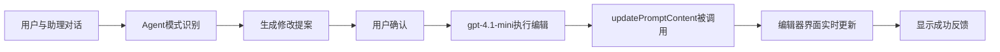

# 智能提示词助理集成指南

## 🎯 概述

提示词助理提供了两种集成方式：

1. **基础集成**：简单的状态回调，适合快速原型
2. **完整集成**：通过接口直接操作编辑器，适合生产环境

## 🚀 快速开始

### 基础集成

```typescript
import { AssistantChat } from '@/components/prompt-assistant';

function MyComponent() {
  const [promptContext, setPromptContext] = useState<AssistantContext>({
    currentMessages: [/* 你的消息 */],
    variables: [/* 你的变量 */],
    testCases: [],
    language: 'zh'
  });

  return (
    <AssistantChat
      projectId={1}
      context={promptContext}
      onContextUpdate={(newContext) => {
        // 基础回调：只更新本地状态
        setPromptContext(newContext);
      }}
    />
  );
}
```

### 完整集成

```typescript
import { AssistantChat, PromptEditorIntegration } from '@/components/prompt-assistant';

function PromptEditor() {
  const [messages, setMessages] = useState([]);
  const [variables, setVariables] = useState([]);

  // 创建集成接口
  const integration: PromptEditorIntegration = {
    getCurrentContext: () => ({
      currentMessages: messages,
      variables,
      testCases: [],
      language: 'zh'
    }),

    updatePromptContent: async (newContext) => {
      // 🔥 关键：这里直接更新实际的编辑器状态
      setMessages(newContext.currentMessages);
      setVariables(newContext.variables);
      
      // 可选：保存到后端
      await saveToBackend(newContext);
    },

    updateMessage: async (index, content, role) => {
      // 精确更新单个消息
      const newMessages = [...messages];
      newMessages[index] = { ...newMessages[index], content, role };
      setMessages(newMessages);
    },

    addMessage: async (content, role, position) => {
      // 添加新消息
      const newMessage = { role, content, order: position || messages.length };
      setMessages([...messages, newMessage]);
    },

    deleteMessage: async (index) => {
      // 删除消息
      setMessages(messages.filter((_, i) => i !== index));
    }
  };

  return (
    <div style={{ display: 'flex' }}>
      {/* 左侧：实际的编辑器 */}
      <div style={{ flex: 1 }}>
        <YourPromptEditor 
          messages={messages} 
          variables={variables}
          onChange={setMessages}
        />
      </div>

      {/* 右侧：智能助理 */}
      <div style={{ width: 400 }}>
        <AssistantChat
          projectId={1}
          context={integration.getCurrentContext()}
          integration={integration}
          callbacks={{
            onEditSuccess: (changes) => {
              message.success(`✅ ${changes.join(', ')}`);
            },
            onEditError: (error) => {
              message.error(`❌ ${error}`);
            }
          }}
        />
      </div>
    </div>
  );
}
```

## 📋 接口说明

### PromptEditorIntegration

| 方法 | 说明 | 必需 |
|------|------|------|
| `getCurrentContext` | 获取当前提示词状态 | ✅ |
| `updatePromptContent` | 更新完整内容 | ✅ |
| `updateMessage` | 更新单个消息 | ⭕ |
| `addMessage` | 添加新消息 | ⭕ |
| `deleteMessage` | 删除消息 | ⭕ |
| `updateVariables` | 更新变量列表 | ⭕ |

### PromptEditCallbacks

| 回调 | 说明 | 何时调用 |
|------|------|----------|
| `onBeforeEdit` | 编辑前确认 | 用户点击"应用修改"前 |
| `onAfterEdit` | 编辑完成 | 编辑成功后 |
| `onEditSuccess` | 编辑成功 | 成功更新编辑器后 |
| `onEditError` | 编辑失败 | 任何错误发生时 |

## 🔥 核心工作流程



## 💡 最佳实践

### 1. 状态同步

```typescript
// ✅ 正确：确保上下文实时同步
const integration: PromptEditorIntegration = {
  getCurrentContext: () => ({
    currentMessages: messages, // 始终返回最新状态
    variables: variables,
    testCases: testCases,
    language: 'zh'
  }),
  // ...
};
```

### 2. 错误处理

```typescript
// ✅ 正确：完善的错误处理
updatePromptContent: async (newContext) => {
  try {
    setMessages(newContext.currentMessages);
    await saveToBackend(newContext);
    message.success('更新成功');
  } catch (error) {
    console.error('更新失败:', error);
    message.error('更新失败，请重试');
    throw error; // 重新抛出错误
  }
}
```

### 3. 性能优化

```typescript
// ✅ 正确：避免不必要的重渲染
const integration = useMemo((): PromptEditorIntegration => ({
  getCurrentContext: () => ({ /* ... */ }),
  updatePromptContent: async (newContext) => { /* ... */ },
}), [messages, variables]); // 依赖明确
```

## 🛠️ 故障排查

### 问题：点击"应用修改"后编辑器没有更新

**原因：** `updatePromptContent` 没有正确更新状态

**解决：**
```typescript
// ❌ 错误：没有更新状态
updatePromptContent: async (newContext) => {
  console.log('收到更新', newContext); // 仅打印日志
}

// ✅ 正确：更新实际状态
updatePromptContent: async (newContext) => {
  setMessages(newContext.currentMessages);
  setVariables(newContext.variables);
}
```

### 问题：编辑操作失败

**检查：**
1. 控制台是否有错误日志
2. `integration.getCurrentContext()` 返回的数据格式是否正确
3. 网络请求是否成功

### 问题：界面更新不及时

**解决：**
```typescript
// 确保使用最新的状态引用
const currentContext = useMemo(() => integration.getCurrentContext(), [messages, variables]);
```

## 📦 完整示例

查看 `IntegratedPromptEditor` 组件获取完整的工作示例：

```typescript
import { IntegratedPromptEditor } from '@/components/prompt-assistant';

function App() {
  return <IntegratedPromptEditor />;
}
```

这个示例展示了：
- ✅ 双向数据绑定
- ✅ 实时编辑更新
- ✅ 错误处理
- ✅ 状态反馈
- ✅ 完整的编辑器集成

## 🎉 总结

通过 `PromptEditorIntegration` 接口，你可以：

1. **无缝集成**：助理直接操作你的编辑器
2. **实时更新**：修改立即反映到界面
3. **精确控制**：支持单个消息、变量的精确编辑
4. **错误处理**：完善的错误反馈和重试机制
5. **生产就绪**：支持保存到后端、状态持久化等

现在你的用户可以通过自然语言对话来编辑提示词，就像使用 Cursor 编辑代码一样！🚀 